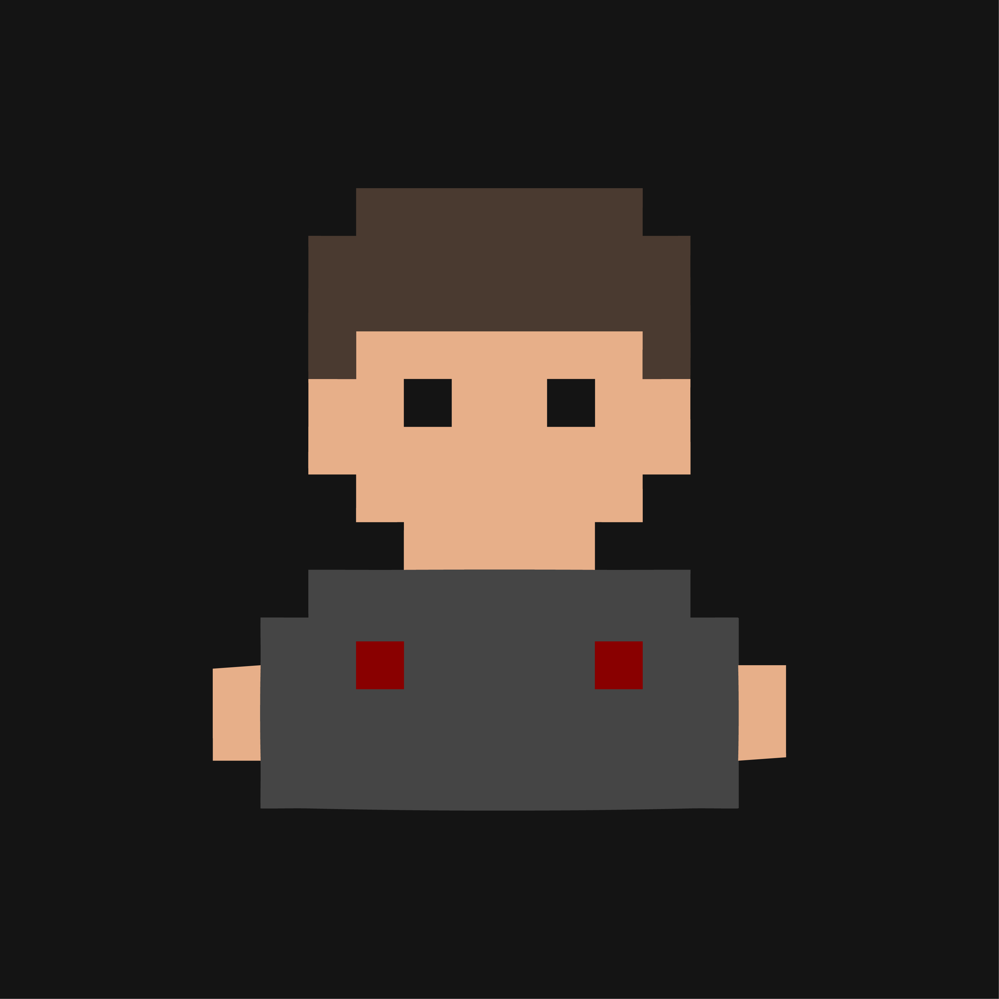
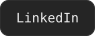
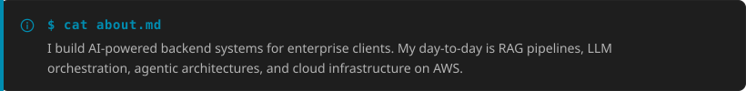
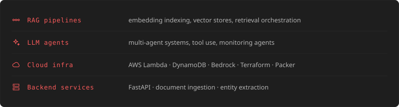
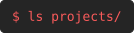

<!-- TN:HEADER -->
<table width="100%">
<tr>
<td width="140" align="center" valign="top">
  
</td>
<td valign="middle">

```
$ whoami
```

# Federico Bianchetti
**AI Engineer · RAG & LLM Systems · Cloud Infrastructure**

</td>
</tr>
</table>


<a href="https://github.com/FakeBlubba"></a> <a href="https://www.linkedin.com/in/federico-bianchetti-6b5464204/"></a>
<!-- /TN:HEADER -->





## What I work on




## Tech

<!-- TN:TECH -->
**LOADOUT · AI/ML**


**LOADOUT · Cloud & Infra**


**LOADOUT · Databases**


<!-- /TN:TECH -->


## Featured projects

<!-- TN:PROJECTS -->


<a href="https://github.com/FakeBlubba/FrameDeployer"></a>

Automated video generation from trending topics: NLP summarization, sentiment analysis, TTS, subtitle sync


<a href="https://github.com/FakeBlubba/depression-pre-diagnose-model"></a>

BERT-based NLP classifier for depression symptom detection from text and audio


<a href="https://github.com/FakeBlubba/MAADB"></a>

Sentiment analysis on tweets: MongoDB MapReduce vs PostgreSQL performance comparison


<!-- /TN:PROJECTS -->


## Stats

<!-- TN:STATS -->
<div align="center">
  
  
</div>
<!-- /TN:STATS -->

## Background

- M.Sc. AI & Information Systems — Università degli Studi di Torino
- `2026` Claude Code 101 & Claude Code in Action — Anthropic

<details>
<summary>▸ $ make profile</summary>

Questo profilo è generato da uno script (`scripts/generate-readme-theme.mjs`) che legge i design token del pacchetto privato `@fakeblubba/terminal-noir` e produce ogni badge, chip, alert e card SVG qui sopra usando i contratti dei componenti reali del design system. Una GitHub Action lo rilancia quando il pacchetto cambia versione.

</details>

<details>
<summary>▸ $ cat learning.log</summary>

Claude Code 101 & Claude Code in Action (Anthropic, 2026) — e la pratica diretta: questo stesso README è stato costruito con un agente Claude Code, iterando su design system, generazione SVG e GitHub Actions.

</details>

<p align="center">
  
  <sub><i>made in 8-bit, Torino</i></sub>
</p>
